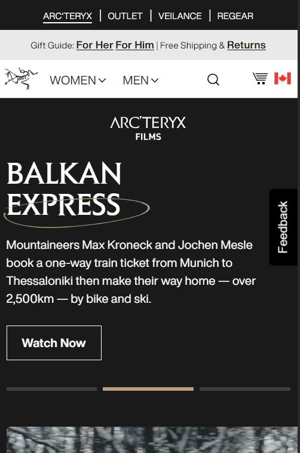
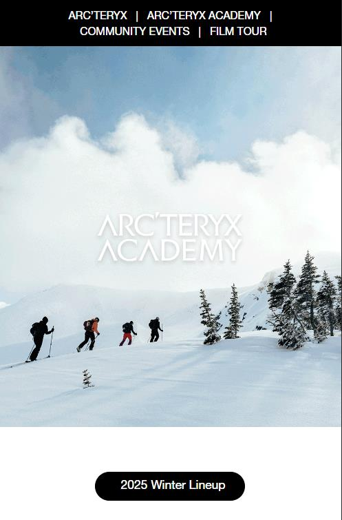
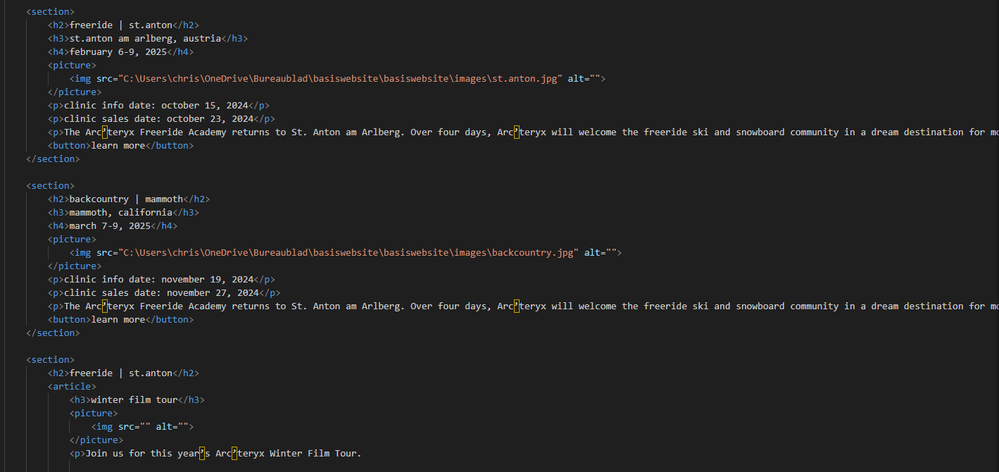
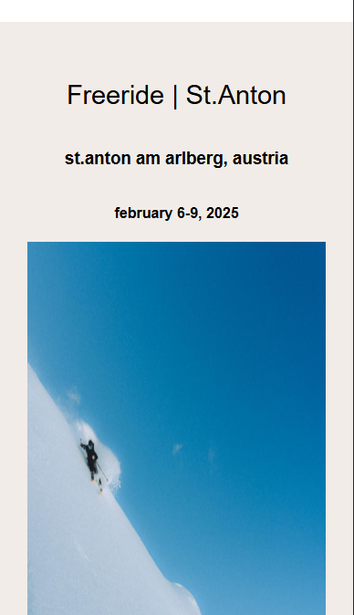
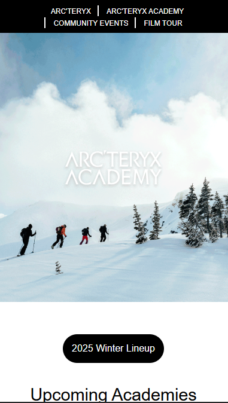
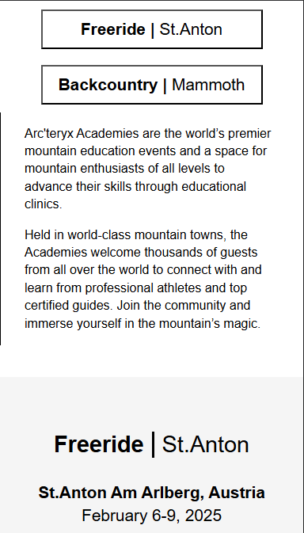
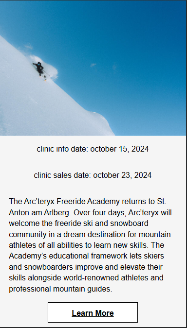
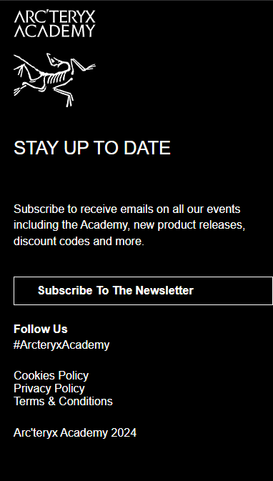

# Procesverslag
Markdown is een simpele manier om HTML te schrijven.  
Markdown cheat cheet: [Hulp bij het schrijven van Markdown](https://github.com/adam-p/markdown-here/wiki/Markdown-Cheatsheet).

Nb. De standaardstructuur en de spartaanse opmaak van de README.md zijn helemaal prima. Het gaat om de inhoud van je procesverslag. Besteedt de tijd voor pracht en praal aan je website.

Nb. Door *open* toe te voegen aan een *details* element kun je deze standaard open zetten. Fijn om dat steeds voor de relevante stuk(ken) te doen.

## Jij

  
uitwerken voor kick-off werkgroep

  ### Auteur:
  Christian de With

  #### Je startniveau:
  Rood

  #### Je focus:
  Responsive
 

## Je website

  
uitwerken voor kick-off werkgroep

  ### Je opdracht:
  De site die ik gekozen heb is Acteryx.com

  #### Screenshot(s) van de eerste pagina (small screen): 
  Films
  https://arcteryx.com/ca/en/explore/films
  

  #### Screenshot(s) van de tweede pagina (small screen):
  Academie
  https://arcteryxacademy.com/
  
 

## Toegankelijkheidstest 1/2 (week 1)

  
uitwerken na test in 2e werkgroep

  ### Bevindingen
  Lijst met je bevindingen die in de test naar voren kwamen:

  global code
  - er word geen gebruik gemaakt van landmark tags zoals: nav en main. 
  
  keyboard
  - 1 pagina heeft wel een goede focus stijl de ander heeft er geen. 
  
  images
  - geen image heeft een alt attribute.
  - geen text alternative voor complexe images.
  - geen alt beschrijving voor image met text. 

  headings
  - zo goed als geen gebruik van headings.
  - vaak p gebruik ipv. h2,h3. 

  media
  - gif en video's spelen automatisch af.
  - media kan niet gepauzeerd worden.

  video
  - geen captions

  audio
  - transcript niet aanwezig. 

## Breakdownschets (week 1)

  
uitwerken na afloop 3e werkgroep

  ### de hele pagina: 
  

  ### dynamisch deel (bijv menu): 
  

  ### wellicht nog een dynamisch deel (bijv filter): 
  

## Voortgang 1 (week 2)

  
uitwerken voor 1e voortgang

  ### Stand van zaken
  hier dit ging goed & dit was lastig (neem ook screenshots op van delen van je website en code)

  Ik ben bezig geweest met de basis html van de academy pagina. 

  ### Agenda voor meeting
  samen met je groepje opstellen

  | student 1      | student 2          | student 3    | student 4        |
  | ---            | ---                | ---          | ---              |
  | dit bespreken  | en dit             | en ik dit    | en dan ik dat    |
  | en dat ook nog | dit als er tijd is | nog een punt | dit wil ik zeker |
  | ...            | ...                | ...          | ...              |

  ### Verslag van meeting
  hier na afloop snel de uitkomsten van de meeting vastleggen

  - punt 1: img verkeerd gebruikt
  - punt 2: headings kloppen niet helemaal. sommige h2 moeten opgesplitst in h2 en h3. 
  - punt 3: div om sommige dingen naast elkaar te krijgen. 
  - punt 4: Breakdownschets maken. 

## Voortgang 2 (week 3)

  
uitwerken voor 2e voortgang

  ### Stand van zaken
  hier dit ging goed & dit was lastig (neem ook screenshots op van delen van je website en code)
  Ik ben bezig geweest met de css voor de arcteryx academy pagina. 
  

  ### Agenda voor meeting
  samen met je groepje opstellen

  | student 1      | student 2          | student 3    | student 4        |
  | ---            | ---                | ---          | ---              |
  | dit bespreken  | en dit             | en ik dit    | en dan ik dat    |
  | en dat ook nog | dit als er tijd is | nog een punt | dit wil ik zeker |
  | ...            | ...                | ...          | ...              |

  ### Verslag van meeting
  hier na afloop snel de uitkomsten van de meeting vastleggen

  - punt 1: gebruik actricle voor het "other events" deel.
  - punt 2: plaatjes volle breedte
  - punt 3: website is niet echt consistent met vormgeving.
  - punt 4: button en a op de juiste manier gaan gebruiken. 
  - punt 5: hero image veranderd bij bepaalde breedte.
  - punt 6: onzichtbare h1.

## Toegankelijkheidstest 2/2 (week 4)

  
uitwerken na test in 9e werkgroep

  ### Bevindingen
  Lijst met je bevindingen die in de test naar voren kwamen (geef ook aan wat er verbeterd is):

## Voortgang 3 (week 4)

  
uitwerken voor 3e voortgang

  ### Stand van zaken
  hier dit ging goed & dit was lastig (neem ook screenshots op van delen van je website en code)
  Ik heb de acteryx academy pagina zo goed als af. 
    
    
    
    
    

  ### Agenda voor meeting
  samen met je groepje opstellen

  | student 1      | student 2          | student 3    | student 4        |
  | ---            | ---                | ---          | ---              |
  | dit bespreken  | en dit             | en ik dit    | en dan ik dat    |
  | en dat ook nog | dit als er tijd is | nog een punt | dit wil ik zeker |
  | ...            | ...                | ...          | ...              |

  ### Verslag van meeting
  hier na afloop snel de uitkomsten van de meeting vastleggen

  - headers van beide paginas combineren
  - footers van beide paginas combineren
  - carousel in java
  - ...

## Eindgesprek (week 5)

  
uitwerken voor eindgesprek

  ### Je uitkomst - karakteristiek screenshots:
  

  ### Dit ging goed/Heb ik geleerd: 
  Korte omschrijving met plaatjes

  

  ### Dit was lastig/Is niet gelukt:
  Korte omschrijving met plaatjes

  

## Bronnenlijst

  
continu bijhouden terwijl je werkt

  Nb. Wees specifiek ('css-tricks' als bron is bijv. niet specifiek genoeg). 
  Nb. ChatGpT en andere AI horen er ook bij.
  Nb. Vermeld de bronnen ook in je code.

  1. bron 1: https://www.w3schools.com/howto/howto_css_dropdown_navbar.asp 
  2. bron 2: https://developer.mozilla.org/en-US/docs/Web/HTML/Element/details
  3. ...

